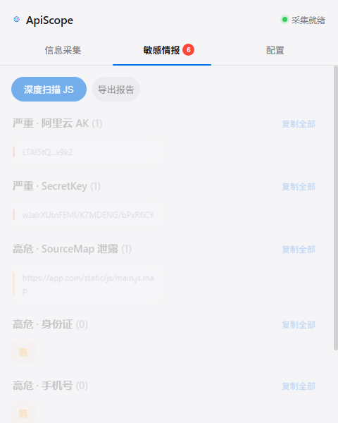

# ApiScope

> 被动式网页 API 接口与敏感信息提取器 —— 一款 Manifest V3 浏览器扩展。
> 一边实时拦截页面 `fetch` / `XHR`，一边从页面源码与外链 JS Bundle 中提取 API 端点、云密钥、私钥、数据库连接串与常见漏洞暴露点，并按风险等级分级展示。

[](https://github.com/gaoqi459-pixel/ApiScope/releases)
[](#)
[](#)
[](./LICENSE)

<p align="center">
  
</p>

---

## ✨ 特性

### 接口采集
- **双通道**：Hook `window.fetch` / `XMLHttpRequest` 实时抓包，同时正则提取 JS Bundle 中写死的绝对路径（`/login`、`/api/v1/user` 等）。
- **自动降噪**：过滤 `.js/.css/.png` 等静态资源与 `/static/`、`/assets/` 等目录，深度扫描自动跳过 jQuery / Vue / ECharts 等第三方库。
- **分组展示**：API 接口、URL 资源、域名、IP 分组成两列卡片，支持搜索与 API/URL 筛选。

### 企业级敏感信息检测
内置 50+ 类规则，参考 TruffleHog / Gitleaks 公开规则：

| 类别 | 示例 |
| --- | --- |
| 云厂商凭据 | AWS AK/SK、阿里云 LTAI、腾讯云 AKID、百度云、火山引擎、京东云 JDC_ |
| 对象存储 | S3 Bucket、阿里云 OSS、腾讯云 COS 域名 |
| 代码托管 / 第三方 | GitHub / GitLab Token、Google API、Stripe、SendGrid、Mailgun |
| 私钥 / 连接串 | RSA / OpenSSH 私钥、MongoDB / MySQL / PostgreSQL / Redis 连接串、JDBC |
| 认证 | JWT、Bearer Token、Authorization 头、Basic Auth、Session/Cookie |
| 通知类 Webhook | Slack、Discord、Telegram Bot |
| 个人信息 | 手机号（号段校验）、身份证（出生日期合法性）、邮箱 |

### 漏洞与暴露点
- **SourceMap 泄露**：自动拼接 `.js.map` 地址并 HEAD 探测可达性。
- **敏感文件暴露**：`.git/config`、`.env`、Swagger 文档、Spring Actuator、Druid 监控台。
- **HTTP 安全头检查**：自动检测 CSP / HSTS / X-Frame-Options / X-Content-Type-Options 缺失。

### 风险分级
命中结果按 **严重（红）/ 高危（橙）/ 中危（黄）** 自动排序，严重密钥类永远排在最前；一键导出 Markdown 扫描报告，可直接作为测试笔记。

---

## 🖥 界面

Apple 风格浅色弹窗：圆角卡片、柔和投影、丝滑过渡。敏感情报页即使未命中也展示类别，覆盖范围一目了然。

---

## 工作原理

```
┌────────────────────┐   fetch/XHR 拦截    ┌─────────────────────┐
│  content.js        │ ──────────────────▶ │                     │
│  (每个页面注入)      │   DOM + 内联脚本扫描   │   background.js      │
│                    │ ──────────────────▶ │  (service worker)   │
└────────────────────┘                     │  按 tabId 分桶存储    │
                                            │  正则引擎 + 深度扫描  │
                                            └──────────┬──────────┘
                                                        │ chrome.storage.session
                                                        ▼
                                            ┌──────────────────────────┐
                                            │   popup.html / popup.js    │
                                            │  分级展示·搜索·复制·导出报告 │
                                            └──────────────────────────┘
```

---

## 安装

1. `git clone https://github.com/gaoqi459-pixel/ApiScope.git`
2. 打开 `chrome://extensions/`（Edge 用 `edge://extensions/`）
3. 开启右上角 **开发者模式**
4. 点 **加载已解压的扩展程序**，选择 `ApiScope` 文件夹
5. 固定图标，访问任意网页，点 **「深度扫描 JS」** 即可

---

## 使用

| 操作 | 说明 |
| --- | --- |
| 信息采集 | API 接口、URL、域名、IP |
| 敏感情报 | 按严重/高危/中危分组，单条或整组一键复制 |
| 深度扫描 JS | 后台下载并分析页面引用的 JS 文件 |
| 导出报告 | 下载 Markdown 报告，按等级分组列出全部命中 |
| 配置 | 安全模式开关、域名白名单 |

---

## 技术栈

Manifest V3 · Content Script + Service Worker + Popup · 原生 HTML/CSS/JS 零依赖 · `chrome.storage.session` 分桶存储 · `MutationObserver` SPA 适配。

---

## 隐私与安全

- 所有数据仅存于本地浏览器，不上传任何服务器。
- 仅提取 URL / 方法等元信息，不记录请求体与响应体。
- 仅供授权的安全测试与 CTF 使用，请遵守目标站点条款与相关法律法规。

## License

[MIT](./LICENSE)
